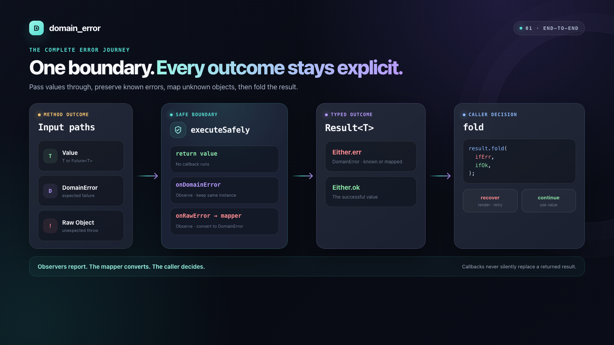
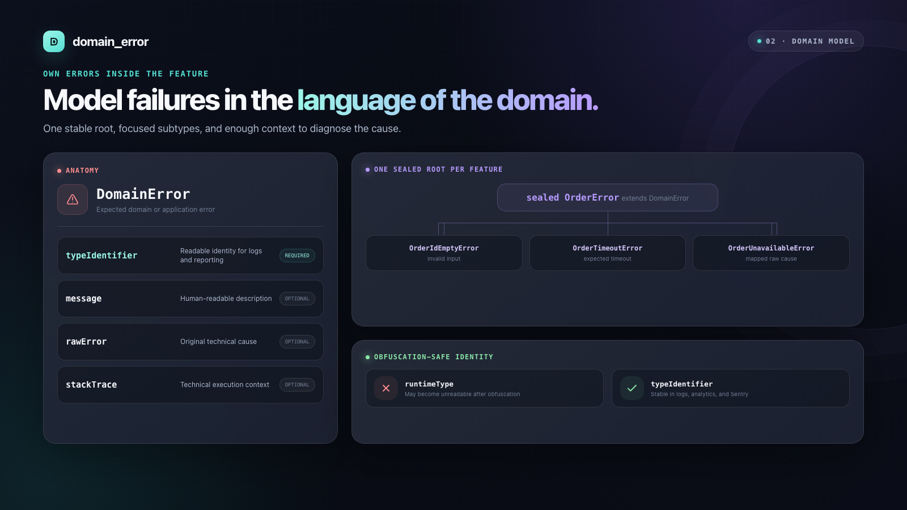
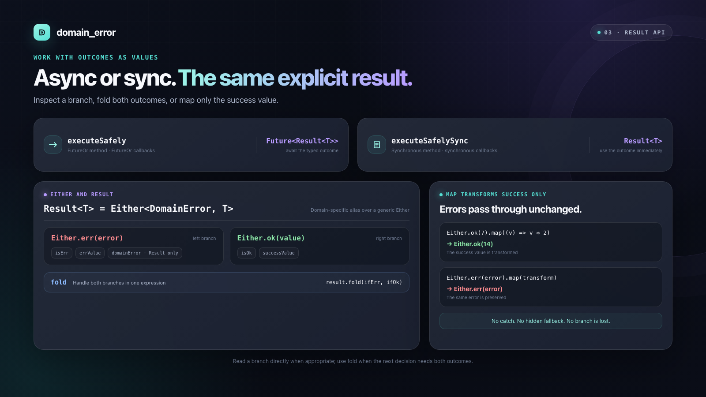

# domain_error



Turn thrown errors into values you can fold.

A domain error is a `DomainError`. An outcome is a `Result<T>`:
`Either<DomainError, T>`. On a `Result`, `domainError` is the failed
`DomainError`. A generic `Either` uses `errValue`. `executeSafely` and
`executeSafelySync` run a function and return that result.

## Model errors



One sealed error root per feature. Set `typeIdentifier` yourself. It stays
readable after obfuscation.

## Install

```yaml
dependencies:
  domain_error: ^2.1.1
```

## Use



```dart
import 'dart:async';

import 'package:domain_error/domain_error.dart';

sealed class OrderError extends DomainError {
  const OrderError({super.message, super.rawError, super.stackTrace});

  @override
  String get typeIdentifier => 'OrderError';
}

final class OrderIdEmptyError extends OrderError {
  const OrderIdEmptyError();

  @override
  String get typeIdentifier => 'OrderIdEmptyError';
}

final class OrderTimeoutError extends OrderError {
  const OrderTimeoutError();

  @override
  String get typeIdentifier => 'OrderTimeoutError';
}

final class OrderUnavailableError extends OrderError {
  const OrderUnavailableError({super.rawError, super.stackTrace});

  @override
  String get typeIdentifier => 'OrderUnavailableError';
}
```

Catch throws. Map unexpected objects. Fold the result.

```dart
final result = await executeSafely<Order>(
  () {
    if (id.isEmpty) {
      throw const OrderIdEmptyError();
    }
    return loadOrder(id: id);
  },
  options: ExecuteSafelyOptions(
    mapRawErrorToDomain: (rawError, stackTrace) {
      if (rawError is TimeoutException) {
        return const OrderTimeoutError();
      } else {
        return OrderUnavailableError(rawError: rawError, stackTrace: stackTrace);
      }
    },
    onDomainError: (domainError, stackTrace) { /* log */ },
    onRawError: (rawError, stackTrace) { /* log */ },
  ),
);

result.fold(
  (domainError) => print(domainError.typeIdentifier),
  (successValue) => print(successValue.title),
);

final syncResult = executeSafelySync<Order>(
  () => loadOrder(id: id),
  options: ExecuteSafelySyncOptions(
    mapRawErrorToDomain: (rawError, stackTrace) {
      return OrderUnavailableError(rawError: rawError, stackTrace: stackTrace);
    },
  ),
);
```

If the function throws a `DomainError`, you get that same object.
If it throws anything else, you get what `mapRawErrorToDomain` returns.
`onDomainError` and `onRawError` only observe. They do not change the result.

Runnable sample: [`example/domain_error_example.dart`](example/domain_error_example.dart).

## License

MIT. Issues: https://github.com/pchkauu/domain_error/issues
